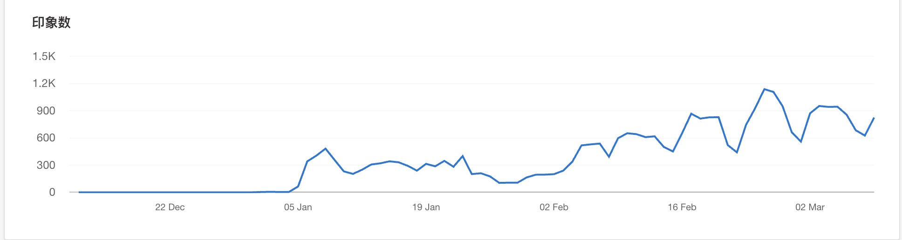
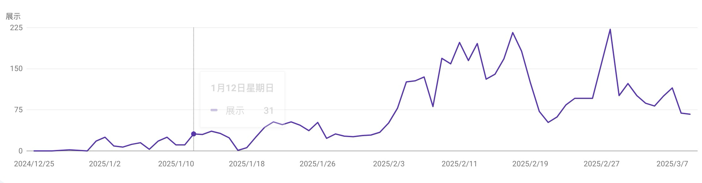
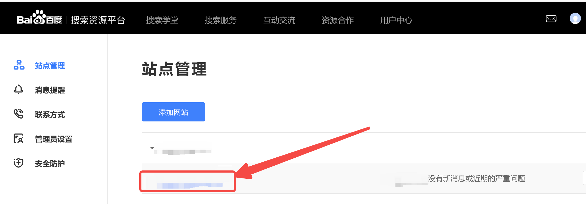
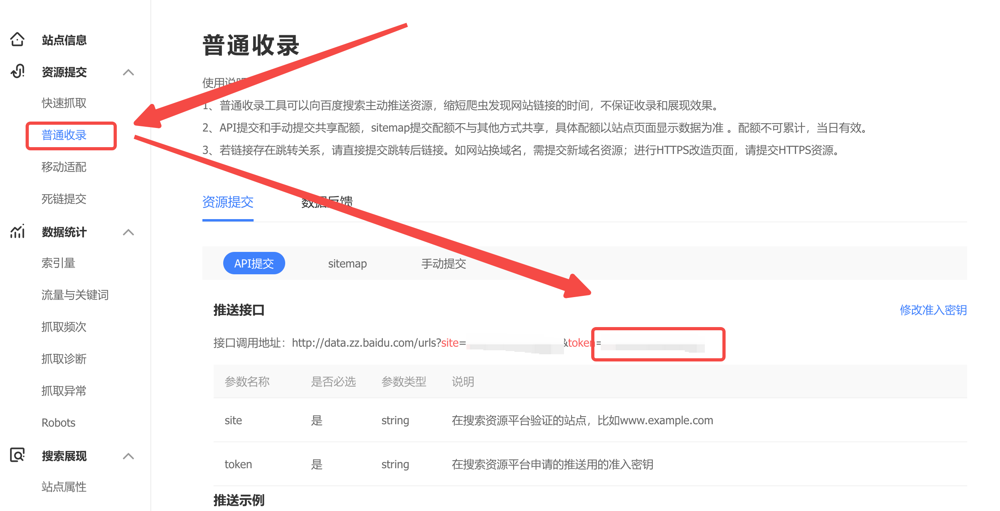
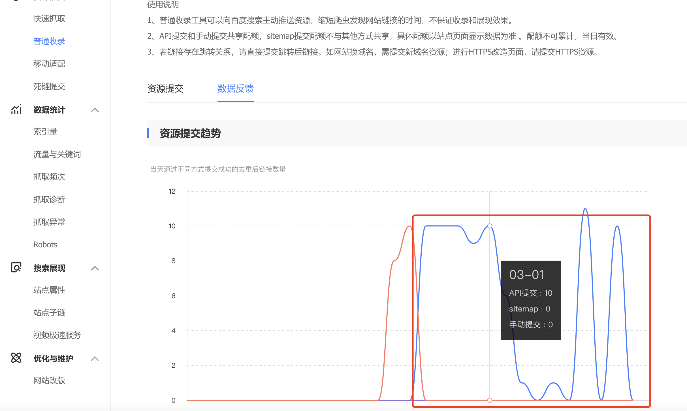
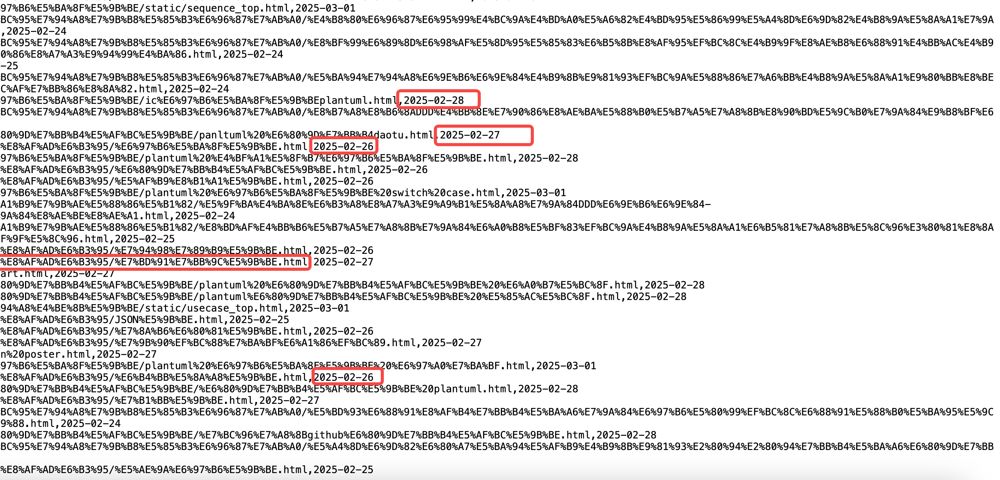
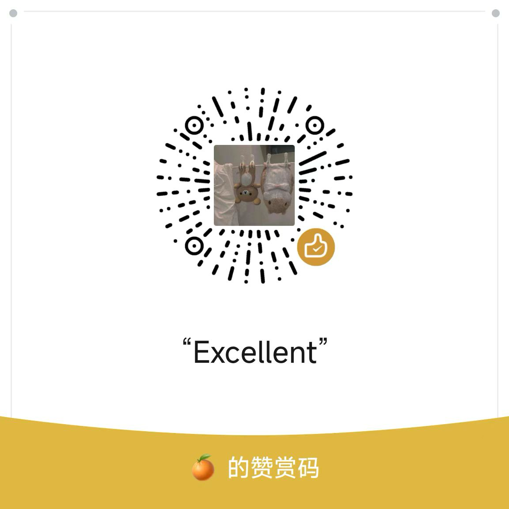

# 最好的百度提交每日自动提交工具【免费】

|        |                                                        |
| ------ | ------------------------------------------------------ |
| github | https://github.com/nogeek-cn/baidu-seo-auto-push-daily |
| gitee  | https://gitee.com/nogeek-cn/baidu-seo-auto-push-daily  |

## 本工具比别的工具好的地方

1. **【免费：你只需要在你的网站中添加我的网站友链，我就可以帮你提交百度 SEO】**
2. 自动提交【别的网站上的都需要手动提交】
3. 页面更新，自动提交
   - 根据 sitemap.xml 更新自动提交【如果发现 sitemap.xml 中有了更新的日期，对比上一次的更新时间，如果 sitemap.xml 中的更新时间在上一次的提交时间之后，那么就会立马提交】
4. 简单方便
   - 提交【网站、baidu_seo_token、sitemap 地址】就可以了
5. 就可以每天打开 【百度资源平台】查看收录的反馈了
6. 最新更新优先提交，在提交次数有限的情况下，优先提交最近更新的页面
7. 每次提交一个，直到今天的提交次数耗费完毕

## 自动批量提交的介绍

### 在线URL链接自动批量提交工具介绍

1. 链接提交工具是网站主动向百度搜索推送数据的工具，本工具可缩短爬虫发现网站链接时间，网站时效性内容建议使用链接提交工具，实时向搜索推送数据。本工具可加快爬虫抓取速度，无法解决网站内容是否收录问题

2. URL链接自动批量提交工具为站长提供链接批量提交通道，您可以提交想被百度收录的链接，百度搜索引擎会按照标准处理，但不保证一定能够收录您提交的链接。

### 使用批量推送功能会达到怎样效果

- 及时发现：可以缩短百度爬虫发现您站点新链接的时间，使新发布的页面可以在第一时间被百度收录
- 保护原创：对于网站的最新原创内容，使用主动推送功能可以快速通知到百度，使内容可以在转发之前被百度发现

### 如何查看批量url提交推送反馈

请前往 [站长平台](https://ziyuan.baidu.com/) 查看您的推送效果!

每当发布了新文章或者新站,都可以通过本工具,自动批量推送给搜索引擎,使新发布的页面可以在第一时间被百度收录！

## 为什么做百度每日自动提交

- 我最近做了一些网站，为了让网站有更多的人访问，我就开始尝试去做 SEO（搜索引擎优化）
- 我的【bing、google】也算是有一些增长，唯独百度的曝光一直上不去，连收录都上不去

### Bing的SEO增长现状

### 谷歌的SEO增长现状

## 百度的收录不收录的几个原因

- sitemap.xml 无法提交【应该是只有百度的 资源平台VIP合作伙伴 才能够拥有】
  - [《百度资源平台VIP俱乐部介绍及申请》](https://ziyuan.baidu.com/vip/index)
- 快速抓取也不生效，经过本人尝试，现在的很多百度 前端 js自动提交的也都是不生效的。
  - 很多博文写都可以自动提交，其实你没有快速抓取的权限，根本无法快速提交的

## 提交给百度的两个方法

- 手动提交
  - 每天登陆到百度去手动提交
  - 优点：
    - 想提交什么，提交什么
    - 立马能看到结果
  - 缺点
    - **太累了，每次打开百度网站，去提交太慢了。操作来操作去的，太慢了。**
    - **容易出错：你昨天提交的 URL，今天最好不要提交，今天最好提交今天更新的页面，这样保证你仅有的几次提交机会可以提交**
- API 提交
  - 通过程序的方式去提交 API
  - 优点：
    - 自动化
  - 缺点
    - 需要写程序进行管理

----

## 常见问题

### 需要给我哪些东西？

1. 域名
2. 百度 token
3. Sitemap.xml 网络地址

### 百度 token 哪里找？

百度资源网站列表管理界面： https://ziyuan.baidu.com/site/index#/

#### 打开百度资源网站列表管理界面

#### 点击普通收录

这里就是你的网站的 token

### sitemap 需要什么格式

例如我网站：https://nogeek.cn 的 sitemap 的格式就是：https://nogeek.cn/sitemap.xml

### 从哪里看提交了多少资源：百度API提交数据反馈页面

### 别的前端插件的自动提交靠谱吗？

不靠谱，你可能看到一些 vuepress 或者 hero 的插件，但是那些插件都是基于 快速提交来的。如果你没有快速提交的权限，那么你是无法使用那些插件的功能的。**不要一腔热血的用了，却没有生效被骗了。**

我还做了推送记录的存储，没有推送的存储，那就无法接着推送，当页面更新就能触发推送。

#### 你看了我的推送记录存储记录，就知道我的工具靠谱

## 付费提交或者免费提交

相比于别的外链服务，动辄 **几百美元** 相比，我这个就算特别良心&便宜了

> 我刚公布的时候，就有人找我提交，有几个网站 DR 不符合标准，作为早期用户，那就算是福利了
>
> 想要提交抓紧咯，随着使用的增多会逐步提高 DR 的门槛或价格

| 说明                            | 原价               | 优惠价     | 推荐            |
| ------------------------------- | ------------------ | ---------- | --------------- |
| 添加我的外链 & 你的网站 DR > 10 | ~~**20 元/ 年**~~  | **免费**   | **重磅推荐**    |
| 添加我的外链 & 你的网站 DR > 5  | ~~**40 元/ 年**~~  | 20元/每年  | 加油提高你的 DR |
| 添加我的外链 & 你的网站 DR < 5  | ~~**80 元/ 年**~~  | 30 元/每年 | 加油提高你的 DR |
| 不添加我的外链                  | ~~**120 元/ 年**~~ | 60 元/每年 | 有钱任性！！！  |

> 如何查询你的 DR：https://frogdr.com/

## 付款给我

如果你直接付费提交的话 **一年 50 元**

## 免费提交

你的站点 DR > 10

只需在你的网站中添加上我的网站的外链就可以了，那样子，我就可以为你免费的提交百度的外链。

需要登记的 友链地址信息

> 名称：JavaGuide
>
> 链接：https://javaguide.net
>
> 头像：https://javaguide.net/icon-192.png
>
> 描述：「Java学习 + 面试指南」
>
> OG：https://javaguide.net/JavaGuide-og.png

登记好以后，联系我的 QQ 号，我就开始为你每天提交百度收录了

## 联系我

我的 QQ 号：【3805679466】

| QQ号                    | 微信公众号                            |
| ----------------------- | ------------------------------------- |
|  |  |

> ## 作者：[不止极客](https://javaguide.net) 

